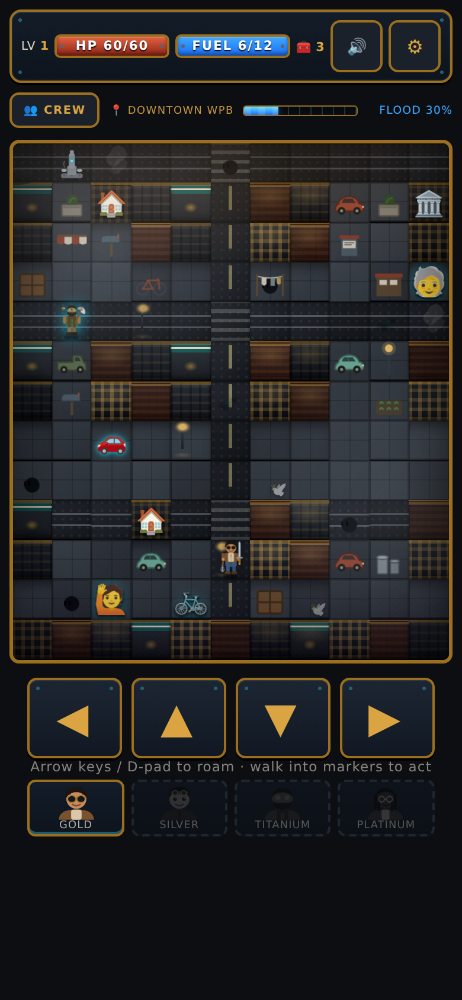

# Salt & Diesel: The Ballad of Ocean Breeze

A dieselpunk episodic RPG set in 1947 West Palm Beach. About 90 minutes of core
story, with optional content to explore. Free to play — donations welcome.

**▶ Play it here (music included):**
https://andjaccep-letscreate.github.io/Salt-and-Diesel-The-ballad-of-ocean-breeze/

Tap or click once on the title screen to unlock the soundtrack — browsers keep
audio muted until the first interaction.

## How to play

- **Move:** arrow keys or WASD
- **Select / confirm:** spacebar
- **On a phone or tablet:** just tap

Step into the streets, take on the city's troubles turn by turn, and see the
ballad through to its end.

## What's inside

- A top-down overworld across four zones of 1947 Palm Beach County — Lake
  Worth docks, Wellington cane country, flooded Downtown WPB, and Palm Island.
- Turn-based battles against Florida-grown enemies, bosses, and one very
  corrupted retiree golfer.
- Salvage, field caches, hidden artifacts, legendary weapons, and a crew that
  talks back.
- An original three-track soundtrack.

## Run it locally

No build step, no dependencies. Download the repo and open `index.html` in any
browser. Keep the `audio/` folder next to `index.html` — that's where the music
lives; everything else is inside the one file.

## A note on how this was made

Built with Claude as a coding efficiency tool. All art, audio, and design are
original.
